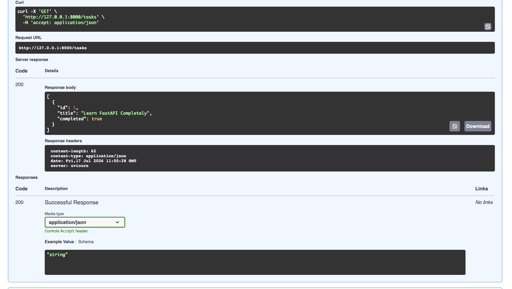
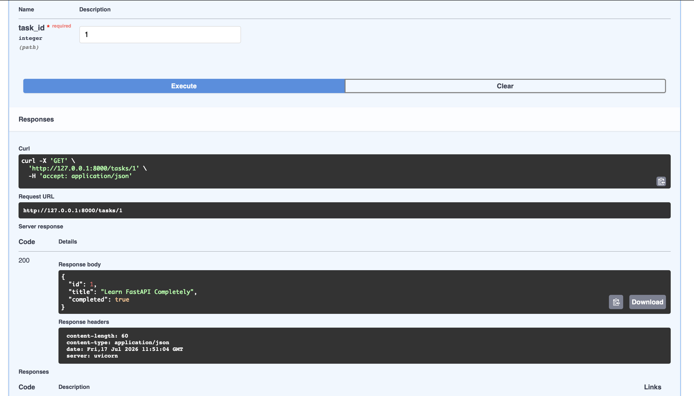
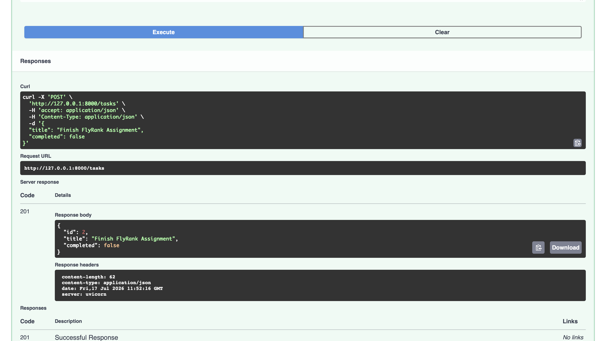
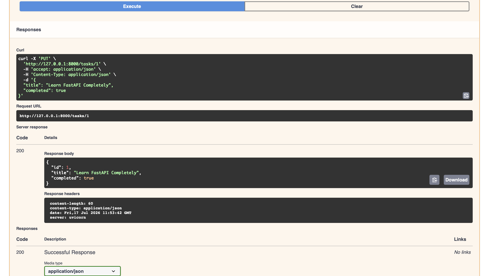
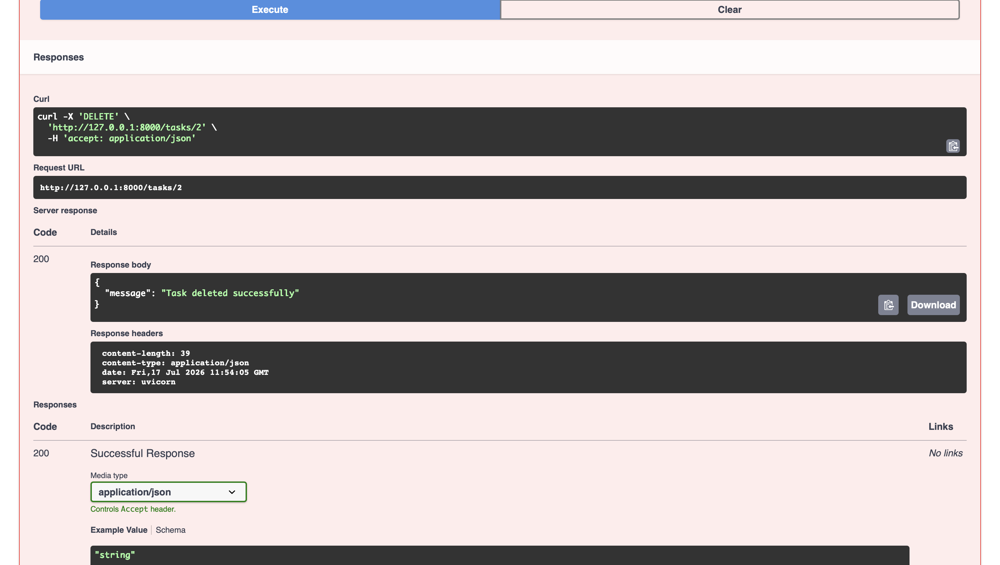
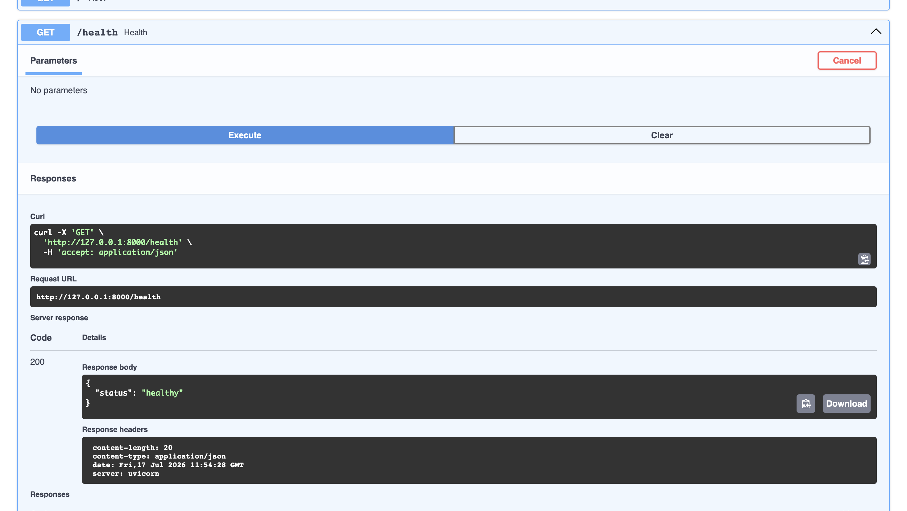

# 🚀 Task API

A RESTful Task Management API built with **FastAPI**, **PostgreSQL**, and **Docker** as part of the FlyRank Backend Engineering Internship.

This project demonstrates CRUD operations, persistent database storage, containerization with Docker, environment variable management, and API documentation using Swagger UI.

---

# ✨ Features

- Create Tasks
- Read Tasks
- Update Tasks
- Delete Tasks
- PostgreSQL Database
- Docker & Docker Compose Support
- Automatic Database Initialization
- Environment Variable Configuration
- Swagger UI Documentation
- Health Check Endpoint

---

# 🛠️ Tech Stack

- Python 3.12
- FastAPI
- PostgreSQL 16
- psycopg2
- Docker
- Docker Compose
- Pydantic
- Uvicorn
- python-dotenv

---

# 📂 Project Structure

```
task-api/
│
├── app/
│   ├── __init__.py
│   ├── config.py
│   ├── database.py
│   ├── main.py
│   ├── models.py
│   └── routes.py
│
├── screenshots/
│
├── Dockerfile
├── docker-compose.yml
├── requirements.txt
├── README.md
├── .env.example
└── .gitignore
```

---

# ⚙️ Environment Variables

Create a `.env` file in the project root.

Example:

```env
DATABASE_URL=postgresql://postgres:dev@db:5432/tasks
```

A sample configuration is available in `.env.example`.

---

# 🐳 Running with Docker Compose

Build and start the complete application:

```bash
docker compose up --build
```

Stop the application:

```bash
docker compose down
```

The application will be available at:

```
http://localhost:8000
```

Swagger UI:

```
http://localhost:8000/docs
```

---

# 💻 Running Locally

Create a virtual environment:

```bash
python3 -m venv .venv
```

Activate it:

```bash
source .venv/bin/activate
```

Install dependencies:

```bash
pip install -r requirements.txt
```

Run the server:

```bash
python3 -m uvicorn app.main:app --reload
```

---

# 📌 API Endpoints

| Method | Endpoint | Description |
|---------|----------|-------------|
| GET | `/` | API Information |
| GET | `/health` | Health Check |
| GET | `/tasks` | Get All Tasks |
| GET | `/tasks/{id}` | Get Task by ID |
| POST | `/tasks` | Create Task |
| PUT | `/tasks/{id}` | Update Task |
| DELETE | `/tasks/{id}` | Delete Task |

---

# 🗄️ Database

The project uses **PostgreSQL 16** running inside Docker.

The application automatically:

- Connects to PostgreSQL using environment variables
- Creates the `tasks` table if it does not exist
- Inserts sample tasks only when the table is empty

The storage layer was migrated from SQLite to PostgreSQL while keeping the REST API endpoints unchanged.

---

# 🐳 Docker

The application consists of two containers:

- **API Container** – FastAPI application
- **Database Container** – PostgreSQL 16

Docker Compose starts the complete stack with a single command.

---

# 💾 Persistence

Data is stored inside a Docker volume.

Verification:

1. Create tasks using Swagger UI.
2. Stop the containers.

```bash
docker compose down
```

3. Restart the stack.

```bash
docker compose up
```

4. Verify that the tasks still exist using:

```
GET /tasks
```

This confirms persistent storage across container restarts.

---

# 📖 API Documentation

Swagger UI is available at:

```
http://localhost:8000/docs
```

All CRUD endpoints can be tested directly from the browser.

---

# 📷 Screenshots

## Swagger UI


## Get All Tasks



## Get Single Task



## Create Task



## Update Task



## Delete Task



## Health Endpoint



## Database


---

# 🎯 Assignment Objectives Covered

- RESTful CRUD API
- PostgreSQL Integration
- Docker Containerization
- Docker Compose
- Environment Variables
- Persistent Database Storage
- Automatic Database Initialization
- Swagger/OpenAPI Documentation
- Git & GitHub Workflow

---

# 👨‍💻 Author

**Hardik Patidar**

Backend AI Engineering Internship Project