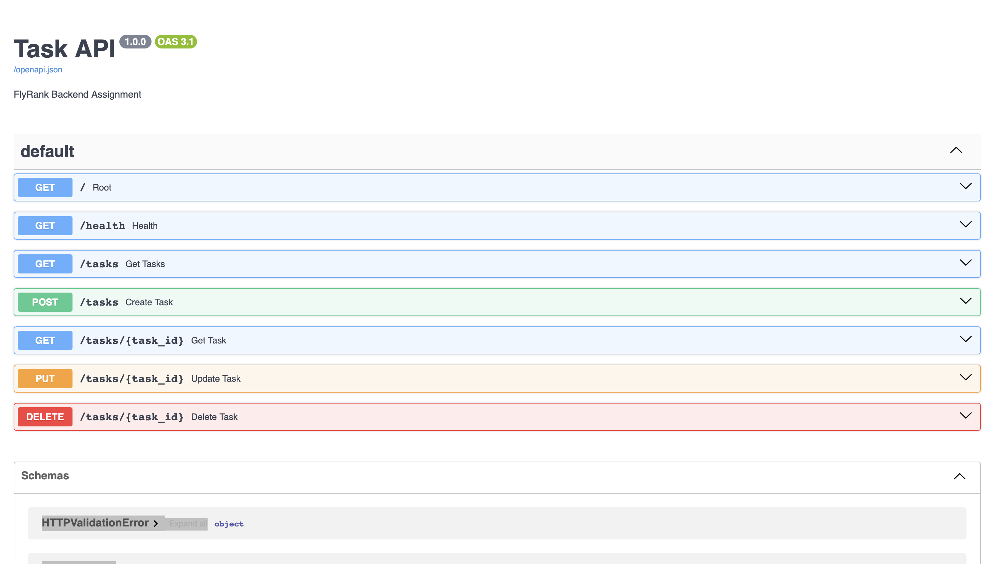
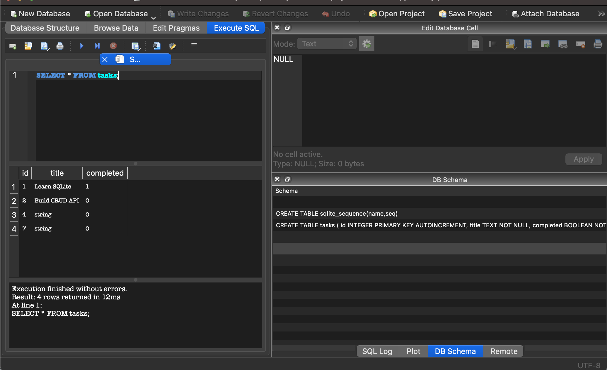

# Task API

A RESTful CRUD API built with **FastAPI** and **SQLite** for the FlyRank Backend Engineering Internship.

---

## Features

- Create Tasks
- Read Tasks
- Update Tasks
- Delete Tasks
- SQLite Database
- Automatic Database Initialization
- Swagger UI Documentation
- Health Check Endpoint

---

## Tech Stack

- Python 3
- FastAPI
- SQLite
- Uvicorn
- Pydantic

---

## Installation

```bash
git clone https://github.com/<your-username>/task-api.git
cd task-api

python3 -m venv .venv
source .venv/bin/activate

pip install -r requirements.txt
```

---

## Run

```bash
python3 -m uvicorn app.main:app --reload
```

Open:

```
http://127.0.0.1:8000/docs
```

---

## Database

This project uses **SQLite** for persistent storage.

- Database file: `tasks.db`
- The database is created automatically on first run.
- The `tasks` table is created automatically if it does not exist.
- Three sample tasks are inserted only when the table is empty.

---

## API Endpoints

| Method | Endpoint | Description |
|---------|----------|-------------|
| GET | / | API Information |
| GET | /health | Health Check |
| GET | /tasks | Get All Tasks |
| GET | /tasks/{id} | Get Task by ID |
| POST | /tasks | Create Task |
| PUT | /tasks/{id} | Update Task |
| DELETE | /tasks/{id} | Delete Task |

---

## Example SQL Query

```sql
SELECT * FROM tasks;
```

---

## Screenshots

### Swagger UI



### Database



---

## Author

Hardik Patidar